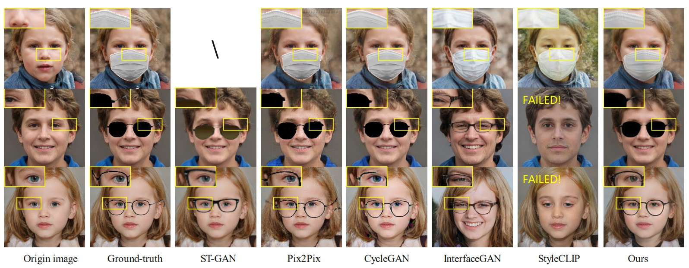
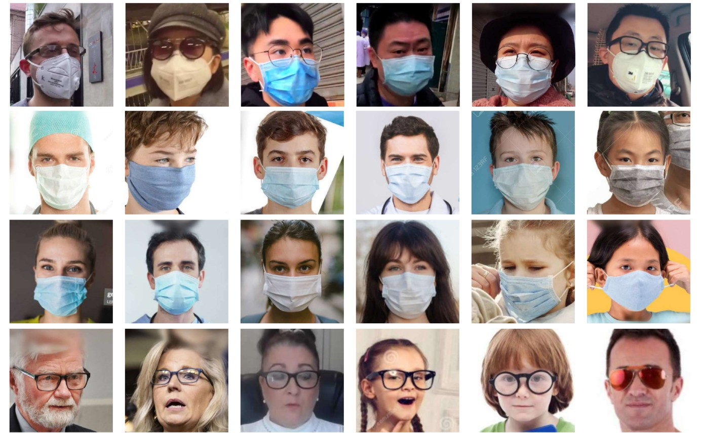

# [ACM MM 2022] SD-GAN: Semantic Decomposition for Face Image Synthesis with Discrete Attribute

This repository contains the official PyTorch implementation and released dataset of the ACM MM 2022 paper:

**SD-GAN: Semantic Decomposition for Face Image Synthesis with Discrete Attribute** <br>
[Kangneng Zhou](https://montaellis.github.io), [Xiaobin Zhu](https://scholar.google.com/citations?user=qF-NGfUAAAAJ), [Daiheng Gao](https://tomguluson92.github.io/), Kai Lee, [Xinjie Li](https://abcdvzz.github.io/), [Xu-cheng Yin](https://scholar.google.com/citations?user=V3hiob0AAAAJ) 


>　Manipulating latent code in generative adversarial networks (GANs) for facial image synthesis mainly focuses on continuous attribute synthesis (e.g., age, pose and emotion), while discrete attribute synthesis (like face mask and eyeglasses) receives less attention. Directly applying existing works to facial discrete attributes may cause inaccurate results. In this work, we propose an innovative framework to tackle challenging facial discrete attribute synthesis via semantic decomposing, dubbed SD-GAN. To be concrete, we explicitly decompose the discrete attribute representation into two components, i.e. the semantic prior basis and offset latent representation. The semantic prior basis shows an initializing direction for manipulating face representation in the latent space. The offset latent presentation obtained by 3D-aware semantic fusion network is proposed to adjust prior basis. In addition, the fusion network integrates 3D embedding for better identity preservation and discrete attribute synthesis. The combination of prior basis and offset latent representation enable our method to synthesize photo-realistic face images with discrete attributes. Notably, we construct a large and valuable dataset MEGN (Face Mask and Eyeglasses images crawled from Google and Naver) for completing the lack of discrete attributes in the existing dataset. Extensive qualitative and quantitative experiments demonstrate the state-of-the-art performance of our method.

<a href="https://arxiv.org/abs/2207.05300"></a>
<a href="https://opensource.org/licenses/MIT"></a> 
<a href="https://dl.acm.org/action/downloadSupplement?doi=10.1145%2F3503161.3547791&file=MM22-fp0237.mp4"></a> 


<p align="center">
  
<br>
Representative visual results of different methods. Our method outperforms other methods on visual quality.
</p>


# Table of Contents
- [Getting Started](#getting-started)
  * [Prerequisites](#prerequisites)
  * [Notice](#notice)
- [Proposed Dataset for Traing StyleGAN](#proposed-dataset-for-traing-stylegan)
- [Pretrained Models](#pretrained-models)
- [Inference](#inference)
  * [Face image synthesis with face mask](#face-image-synthesis-with-face-mask)
  * [Face image synthesis with sun glasses](#face-image-synthesis-with-sun-glasses)
  * [Face image synthesis with frame glasses](#face-image-synthesis-with-frame-glasses)
- [Acknowledgments](#acknowledgments)
- [Citation](#citation)


# Getting Started
## Prerequisites
- Linux
- NVIDIA GPU + CUDA CuDNN (CPU may be possible with some modifications, but is not inherently supported)
- Python 3
- PyTorch >= 1.6.0
- Neural Render Requirement in [unsup3d environment](https://github.com/elliottwu/unsup3d/blob/master/environment.yml)

## Notice
- We train a StyleGAN2 model based on offical implement and convert it to Pytorch format using [convert_weight.py](https://github.com/rosinality/stylegan2-pytorch/blob/master/convert_weight.py).


# Proposed Dataset for Traing StyleGAN
* MEGN: 

<a href="https://drive.google.com/file/d/1c1qOqrlK8xBQ_M00nDav79g43Raby9aY/view?usp=sharing"></a> 

<p align="center">
  
<br>
Our MEGN for training generator.
</p>


# Pretrained Models
* [Retrained StyleGAN2 Model](https://drive.google.com/file/d/1IgLlHfjBA8EepD8VhCympkjJkFpLqzu7/view?usp=sharing)
* [Face Image Synthesis Model for Face Mask](https://drive.google.com/file/d/1iMCRS-3NFKO3CcFDcPj9alS7D96PHy4-/view?usp=sharing)
* [Face Image Synthesis Model for Sun Glasses](https://drive.google.com/file/d/18C_Irbmkl91Cz86o9gj_rwPzZNPcSwvE/view?usp=sharing)
* [Face Image Synthesis Model for Frame Glasses](https://drive.google.com/file/d/15G9PZg9gtAyjDj4uXZEhSVaxpUgTqDdv/view?usp=sharing)


# Inference

```
put StyleGAN2 model and pretrained model from [Unsup3d](https://github.com/elliottwu/unsup3d) to 'pretrained'
mkdir data
```


## Face Image Synthesis with Face Mask
```
modify 'output_dir' in hparams.py to a fold you want to save synthesized images
put face image synthesis model for face mask to 'output_dir'
modify 'kind' in hparams.py to 'mask'
modify 'w_file' in hparams.py to 'data/w_mask_test_1000.json'
modify 'interface_file' in hparams.py to 'data/mask_interfacegan_test_1000.json'
python test.py
```

## Face Image Synthesis with Sun Glasses
```
modify 'output_dir' in hparams.py to a fold you want to save synthesized images
put face image synthesis model for glasses mask to 'output_dir'
modify 'kind' in hparams.py to 'glasses'  
modify 'is_normal' in hparams.py to 'False'
modify 'w_file' in hparams.py to 'data/w_glasses_test_1000.json'
modify 'interface_file' in hparams.py to 'data/glasses_interfacegan_test_1000.json'
python test.py
```

## Face iImage Synthesis with Frame Glasses
```
modify 'output_dir' in hparams.py to a fold you want to save synthesized images
put face image synthesis model for glasses mask to 'output_dir'
modify 'kind' in hparams.py to 'glasses'
modify 'is_normal' in hparams.py to 'True'
modify 'w_file' in hparams.py to 'data/w_glasses_test_1000.json'
modify 'interface_file' in hparams.py to 'data/glasses_interfacegan_test_1000.json'
python test.py
```


# Acknowledgments
The code borrows from [SEAN](https://github.com/ZPdesu/SEAN), [Unsup3d](https://github.com/elliottwu/unsup3d), [StyleGAN2](https://github.com/NVlabs/stylegan2) and [StyleGAN2-Pytorch](https://github.com/rosinality/stylegan2-pytorch). Thank you to [Jie Zhang](https://scholar.google.com.hk/citations?user=gBkYZeMAAAAJ) for all the help I received.

# Citation
If you use this code for your research, please cite the following work:
```
@inproceedings{zhou2022sd,
    title={SD-GAN: Semantic Decomposition for Face Image Synthesis with Discrete Attribute},
    author={Zhou, Kangneng and Zhu, Xiaobin and Gao, Daiheng and Lee, Kai and Li, Xinjie and Yin, Xu-cheng},
    booktitle={Proceedings of the 30th ACM International Conference on Multimedia},
    pages={2513--2524},
    year={2022}
}
```